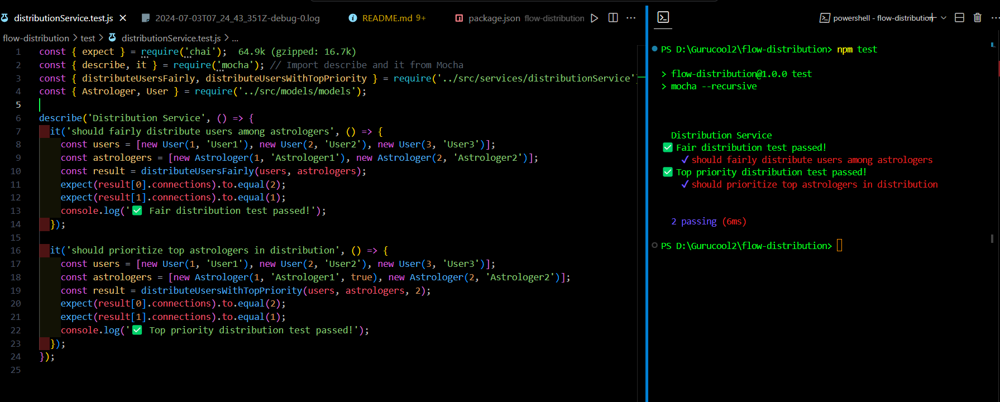

# Flow Distribution API 🌟

## Overview
The Flow Distribution API is a Node.js project that implements a flow distribution algorithm for connecting users with astrologers. It provides endpoints to distribute users among astrologers based on specified factors, ensuring efficient allocation of resources.

## Installation
1. **Clone the repository:**
   ```bash
   git clone <repository_url>
   cd flow-distribution
2. **Install dependencies:**
   ```bash
   npm install
3. **Run the server:**
   ```bash
   npm start

## Usage
### Endpoint
`POST /api/distribute`

#### Summary:
Distribute users among astrologers.

## Distribution Test




#### Description:
Distributes users among astrologers based on a specified factor.


### Responses: {#responses  data-source-line="35"}

200: Successful distribution.
400: Invalid request body.

### Example Code

```javascript

const fetch = require('node-fetch');

async function distributeUsers(topPriorityFactor) {
  try {
    const response = await fetch('http://localhost:3000/api/distribute', {
      method: 'POST',
      headers: {
        'Content-Type': 'application/json'
      },
      body: JSON.stringify({ topPriorityFactor })
    });
    const data = await response.json();
    console.log('Distribution Result:', data);
  } catch (error) {
    console.error('Error distributing users:', error);
  }
}

distributeUsers(2); // Example with topPriorityFactor = 2
```
## Testing

Run tests using:
```bash
npm test
```
### Dependencies

Express: Web framework for Node.js.
Mocha & Chai: Testing frameworks.
Contributing
Contributions are welcome! Please fork the repository and submit pull requests.

### License
This project is licensed under the ISC License.
``bash

This README.md file provides comprehensive information about your Flow Distribution API project, covering installation, usage, example code, testing, dependencies, contributing guidelines, and licensing details. Adjust any specific details or sections as per your project's requirements.```
